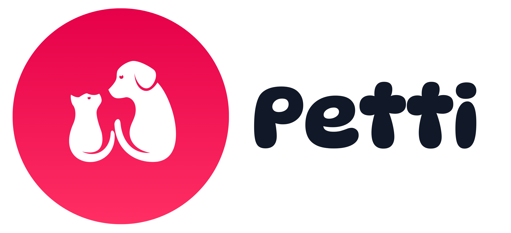

#🐾 petti

  

  <b>The shop and the groomer, both at your door.</b> 
  A modern, full-stack platform designed to eliminate pet travel anxiety by bringing premium supplies and certified at-home pet care directly to pet parents in Amman, Jordan.

  
  
  
  
  

---

## 🌟 About Petti

Petti is built around your pet's comfort. Traditional vet visits and grooming salons often cause severe stress and anxiety for pets and owners alike. Petti solves this by offering a unified marketplace where users can order handpicked pet essentials (food, toys, hygiene, and health items) and seamlessly book certified, background-checked caregivers for at-home visits (grooming, bathing, nail trimming).

---

## ✨ Key Features

### 🛍️ **E-Commerce & Product Catalog**
* **Advanced Filtering & Sorting:** Filter products by pet type (Dog/Cat), category, price range, and in-stock status. Real-time client-side search and sorting (Newest, Price, Top Rated).
* **Shopping Cart & Session Management:** Guest users can freely browse and add items to the cart. Session state preserves cart contents across navigation and transitions smoothly into authentication during checkout.
* **Verified Reviews & Ratings:** Customers who have completed verified purchases can leave ratings and comments on products.

### 🏡 **At-Home Care Booking System**
* **Doorstep Services:** Book certified professionals for grooming, bathing, or nail trimming sessions at home.
* **Interactive Date & Time Slot Picker:** Select convenient appointment windows with upfront, transparent pricing.

### 🔒 **Security & Role-Based Access Control (RBAC)**
* **ASP.NET Core Identity:** Secure authentication system with password complexity rules, account lockout protection, and custom user profiles.
* **Role Management:** Strict separation of duties between standard Customers and Administrators. Protected backend routes (`/Admin`) ensure unauthorized users are cleanly redirected to a custom **Access Denied** page.

### 📊 **Admin Dashboard & Management Console**
* **Overview Analytics:** Real-time KPI metrics tracking total revenue, lifetime orders, pending requests, scheduled home visits, and registered customers.
* **Catalog & Order Management:** Full CRUD operations for products and categories, image gallery uploads, stock tracking, and live order status updates.
* **User Control:** Ability to activate or suspend (lock out) user accounts directly from the admin panel.
* **Content Moderation:** Review and moderate customer product reviews and community success stories (Testimonials).

---

## 🛠️ Tech Stack

* **Backend:** ASP.NET Core MVC (.NET), C#, LINQ, Entity Framework Core (ORM)
* **Authentication:** ASP.NET Core Identity (Role-Based Access Control)
* **Frontend:** HTML5, CSS3, JavaScript (ES6+), Bootstrap 5.3.3
* **State Management:** ASP.NET Core Session 

---

## 🚀 Getting Started

### Prerequisites
Ensure you have the following installed on your machine:
* [.NET SDK](https://dotnet.microsoft.com/) (Compatible version)
* [Microsoft SQL Server](https://www.microsoft.com/sql-server) & [SQL Server Management Studio (SSMS)](https://aka.ms/ssmsfordownload)
* [Visual Studio 2026](https://visualstudio.microsoft.com/) or [VS Code](https://code.visualstudio.com/)

